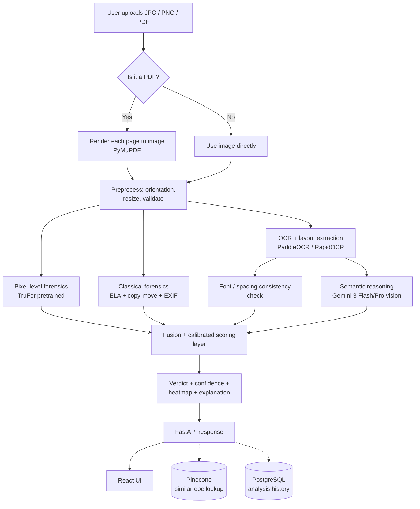

# TamperTrace: Explainable Document Forgery Detection

**Problem Statement:**
Detecting digital alterations in scanned documents (ID cards, certificates, invoices) is an open research problem where standard image forgery methods struggle due to severe class imbalance (tampered regions are tiny). TamperTrace is an explainable web tool that classifies uploaded documents as authentic or tampered using a multi-signal ensemble approach, giving reviewers verifiable evidence rather than just a black-box percentage.

## Live Demo

[View Live Demo Here](#) *(Replace this link with your actual hosted application URL)*

  
  
<em>(Please add your 30-60s demo video/GIF showing the upload and result flow here and name it demo.gif)</em>

## Architecture Diagram

## How Each Signal Works

Our detection methodology uses an explainable ensemble of complementary signals:

1. **Deep Pixel Forensics (TruFor):** A pretrained transformer-based model that detects general manipulation, deepfake-style edits, and cloned/removed regions by analyzing RGB inconsistencies.
2. **Error Level Analysis (ELA):** Identifies splicing and pasted regions by analyzing differences in JPEG compression history. Untouched regions compress predictably; edited regions show higher error levels.
3. **Copy-Move Detection:** Detects duplicated regions (e.g., cloned seals or signatures) by matching keypoint descriptors (ORB/SIFT) within the same image.
4. **Metadata/EXIF Analysis:** Scans for editing-software fingerprints (like Photoshop tags) and timestamp inconsistencies.
5. **OCR + Font/Layout Consistency:** Specifically targets photoshopped text by identifying mismatched fonts, baseline irregularities, and spacing anomalies using PaddleOCR.
6. **Semantic/Logical Reasoning (Gemini Vision):** Cross-checks specific semantic fields (e.g., date chronologies, internal consistencies like totals, and visual plausibility of signatures/seals).

## Tech Stack

| Layer | Technology |
|---|---|
| **Frontend** | React 19 + Vite + TypeScript + Tailwind CSS v4 |
| **UI Components** | shadcn/ui + lucide-react icons |
| **Backend** | FastAPI (Python 3.12) |
| **ML/CV Core** | PyTorch 2.x, OpenCV, Pillow, NumPy |
| **Forgery Localization Model** | TruFor (pretrained, zero-shot) |
| **OCR / Text Extraction** | PaddleOCR |
| **PDF → Image** | PyMuPDF (`fitz`) |
| **LLM Cross-check** | Gemini 3 Flash / Gemini 3 Pro via the Gemini API |
| **Vector DB** | Pinecone |
| **Containerization** | Docker, multi-stage build |
| **Hosting** | Hugging Face Spaces (Docker SDK) |
| **CI** | GitHub Actions |
| **Testing** | Pytest (backend), Vitest (frontend) |

> **Note:** **Vector DB (Pinecone) used for similarity-based duplicate detection across analyzed documents**.

## Running Locally

### Prerequisites
- Python 3.12+
- Node.js 20+
- Pinecone API Key (optional for similar-doc lookup)
- Gemini API Key (optional for semantic checks)

### Backend Setup
1. Clone the repository and navigate to the `backend` directory.
2. Create a virtual environment: `python -m venv .venv`
3. Activate the environment:
   - Windows: `.venv\Scripts\activate`
   - Mac/Linux: `source .venv/bin/activate`
4. Install dependencies: `pip install -r requirements.txt`
5. Copy `.env.example` to `.env` and fill in your API keys.
6. Run the server: `fastapi dev app/main.py` (or `uvicorn app.main:app --reload`)

### Frontend Setup
1. Navigate to the `frontend` directory.
2. Install dependencies: `npm install`
3. Start the dev server: `npm run dev`

## Limitations & Ethical Disclosure

- **This is an automated screening aid, not a certified forensic or legal-evidence tool.**
- Accuracy varies meaningfully by document type, image quality, and language — the performance on a smartphone photo will differ from a proper flatbed scan.
- Per current (2026) academic benchmarking, document forgery detection is a genuinely unsolved research problem — every existing method, including this one, has real generalization gaps, especially against newer diffusion/AI-based edits.
- The tool should **not** be used as the sole basis for a legal, financial, or identity decision.

## Future Improvements (With More Time)

- **Train a logistic-regression meta-model:** Improve the weighted-average fusion layer by training a dedicated meta-model on calibration subsets (like DocTamper or SIDTD) for more calibrated confidence scores.
- **Enhanced Vector Lookup:** Expand the Pinecone integration to store perceptual hashes and CLIP embeddings, querying for visually similar tampered documents in real-time.
- **Deeper LLM Reasoning:** Expand the Gemini Vision prompts to perform stricter referential integrity checks on specific fields (e.g. validating address layouts and invoice numbers against known formats).
- **Expand Test Coverage:** Broaden test suites to cover edge cases with corrupted PDFs and extreme low-res images.
